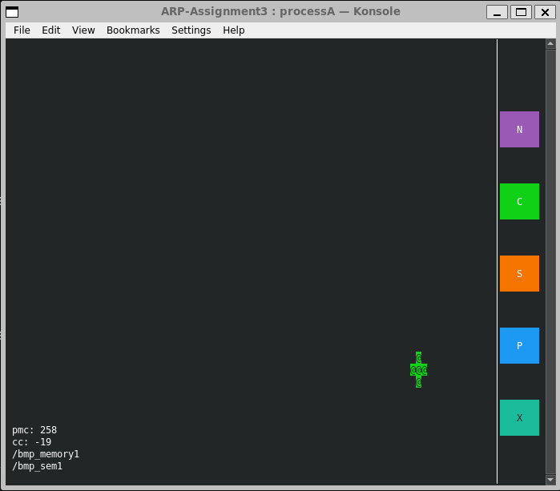
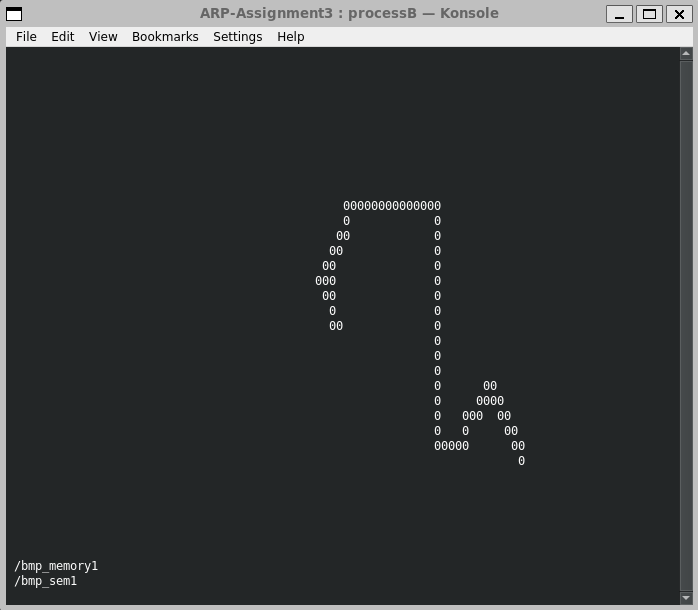

# ARP-Assignment3
Implementation of a simulated vision system using Socket Programming.

The two processes involved in the simulation of the vision system, namely **processA** and **processB**, are implemented as simple *ncurses windows*. The development of the inter-process communication pipeline has been implemented as explained below.

A **master** process responsible of spawning the entire simulation has been given.

All credits to @SimoneMacci0 for development of the base repository for the assignment, at [SimoneMacci0/ARP-Assignment2](https://github.com/SimoneMacci0/ARP-Assignment2).

## *libbitmap* installation and usage
To work with the bitmap library, you need to follow these steps:
1. Download the source code from [this GitHub repo](https://github.com/draekko/libbitmap.git) in your file system.
2. Navigate to the root directory of the downloaded repo and run the configuration through command ```./configure```. Configuration might take a while.  While running, it prints some messages telling which features it is checking for.
3. Type ```make``` to compile the package.
4. Run ```make install``` to install the programs and any data files and documentation.
5. Upon completing the installation, check that the files have been properly installed by navigating to ```/usr/local/lib```, where you should find the ```libbmp.so``` shared library ready for use.
6. In order to properly compile programs which use the *libbitmap* library, you first need to notify the **linker** about the location of the shared library. To do that, you can simply add the following line at the end of your ```.bashrc``` file:      
```export LD_LIBRARY_PATH="/usr/local/lib:$LD_LIBRARY_PATH"```
### Using *libbitmap* in your code
Now that you have properly installed the library in your system, it's time to use it in your programs:
1. Include the library in your programs via ```#include <bmpfile.h>```. If you want to check the content of ```bmpfile.h``` to glimpse the functionalities of the library, navigate to ```/usr/local/include```, where the header file should be located.
2. Compile programs which use the *libbitmap* library by linking the shared library with the ```-lbmp``` command.

## Compiling and running **processA** and **processB**
The two processes are implemented as UIs through *ncurses* library, therefore you need to compile their source files by linking the shared library via ```-lncurses```. As for the first assignment, exploit the resize event of the windows to get out of situations in which the graphical elements do not properly spawn.

We provide a shell script `compile.sh` to compile the application:

```shell
$ ./compile.sh
```

To run:
```shell
$ ./bin/master
```

## A note about the consoles:

The two consoles: 

- The first konsole window of process A simulates movement of an object, in our case a blue circle. The object can be moved with the arrow keys. In order to save a snapshot of the particular instance, press the `P` or the **Print** button. In order to terminate both process A and B and respective konsoles, we have implemented an extra `X` or **Stop** button. 
- For assignment 3, we also implemented additional 3 buttons, used to change the mode of functionality (Normal -> `N`, Server -> `S`, and Client -> `C`). The **Server** and **Client** modes are the modes which use sockets based communication.
- In the lower left corner, we have included some "debugging" information like the last moving command (arrow keys), the curerent command, and the shared memory and semaphore info.



- Example Snapshot of the object after pressing the `P` button taken at some time before moving the controller to shown position. It is saved as `./out/snapshot.bmp`.


- The second konsole window of process B tracks and shows the position of the object.
- We have also added info about the shared memory and semaphore used for the current mode of execution (Normal, Server or Client).




## Programming Paradigms

- The processes A and B use **Shared memory** to communicate information (update and keep track of the RGB image - with the circle). `mmap()` is used to map the shared memory object of the image size and allows writing (by process A) and reading (by process B)
- The processes also make use of a **Semaphore** to access the shared memory synchronously and avoid data corruption.
- We use the `sigaction` POSIX function to perform signal handling for all the pre-existing and user defined signals.
- In this assignment, as mentioned before, we have used Socket communication to allow a server and client modes implemented in a way that the remote user using the `client` mode can control the functionality of the second assignment by sending the key commands over the secket to the `server` process.
- All info and error messages are logged in separate log files maintained for each process.

#### Note:

- Since the `libbitmap` library makes use of dynamic memory to allocate the space needed to represent the `bmpfile_t` data type, it cannot be used in a shared memory. 

- We map the area of shared memory as an `rgb_pixel_t` BGRa structure. A user-defined function `save_bmp()` has been created which takes the `bmpfile_t` image and store (pixel-by-pixel) in an rgb_pixel_t matrix in the shared memory.

- The `BGRa` matrix, which is available and updated continuously in the shared memory, is accessed and used directly in the process B to compute the centre of the circle, instead of saving a separate copy of bmp file for the same purpose.

- To allow complete siumulation of this server-client communication in a single computer, we create different shared memory and semaphores, as well as log files for each mode. We add 1/2/3 to the shared memory name (`/bmp_memory`), the semapore name (`/bmp_sem`) and log file (e.g. `processA1.txt`) for each mode (1 for Normal, 2 for Server and 3 is for Client).


## Brief Explanations about the processes

- Master:
	- The master process asks for user input concerning the "mode" - (`n`, `s`, `c`) and also the port and IP Address in case of the `s` and `c` mode.
	- The Master process spawns the processes A and B in respective konsoles and in the given mode.

- Process A
	- Contains the socket implementation (Server for receiving the conenction request and then inputs from the client to move the circle, and also the Client to send the request)
	- Draws and moves the object (the blue circle).
	- Creates and maps the shared memory object to share the rbg_pixel_t matrix among the processes for communication.
	- Uses semaphore while writing the pixel matrix to shared memory. Uses the function `save_bmp` to save the bitmap image in the form of `rgb_pixel_t` matrix in the shared memory.
	- Checks for keyboard (in the normal (`n`) and client (`c`) modes) and mouse events, moves the object as per the command given by the keyboard and saves a snapshot or terminates the processes upon pressing the respective buttons as mentioned.
	- Implements 3 buttons as mentioned before to change the modality and itself becomes the Server or Client based on the requested mode by the user. The master does not play a role in this functionality and waits for the process to finish.

- Process B
	- Reads the pixel matrix from the shared memory object 
	- Uses semaphore while doing so.
	- Uses the user defined function `find_circle_center()` to compute the center of the circle.
	- Displays the center of the circle on an ncurses window synchronously with the movement of the same in process A.


## Known Issues:

- Upon executing the program for the first time, Process B may fail to open one or more of the file descriptors (shared memory, log file, or the semaphore). In that case, simply closing the konsoles and rerunning the program would solve the problem.
- As mentioned by the Professor, there are still some problems trying to perform this socket communication between different systems using WSL or between a WSL and Native Linux system. The client modality works well (connection between WSL as Client and a native linux system as server has been tested successfully) but the server mode functionality in WSL is prone to failing sometimes to stablish a connection to a remote host.
